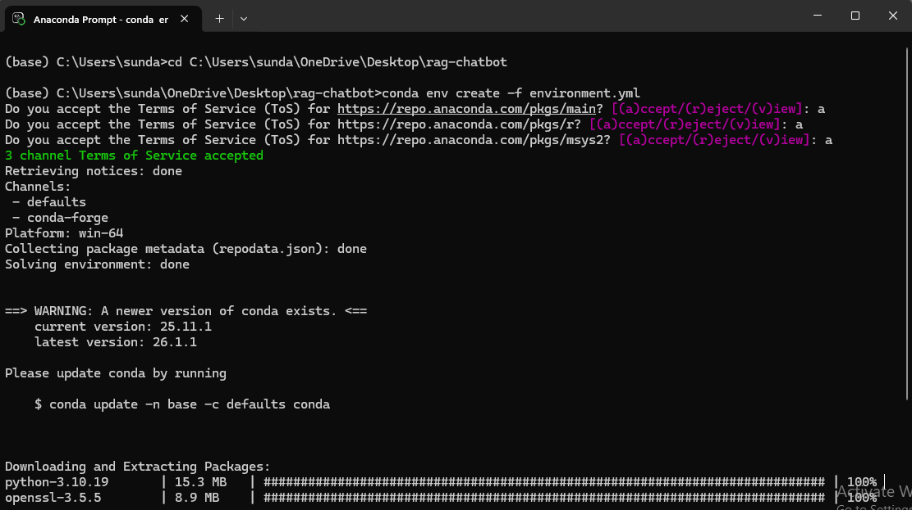
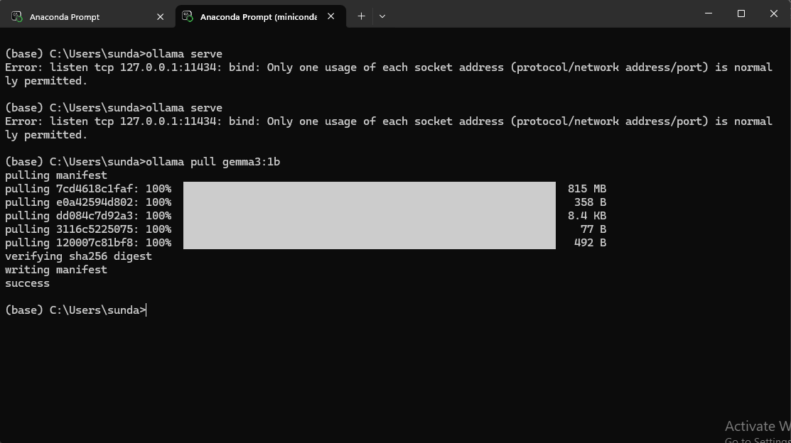
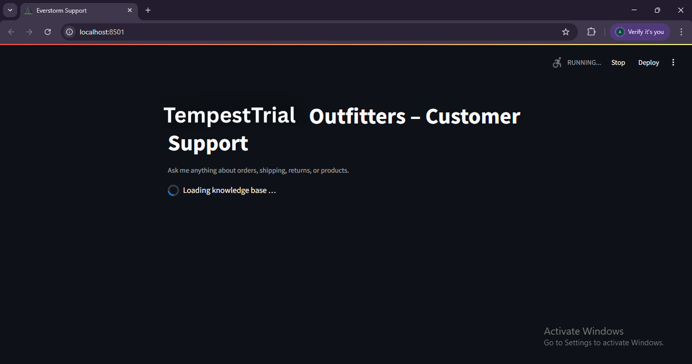
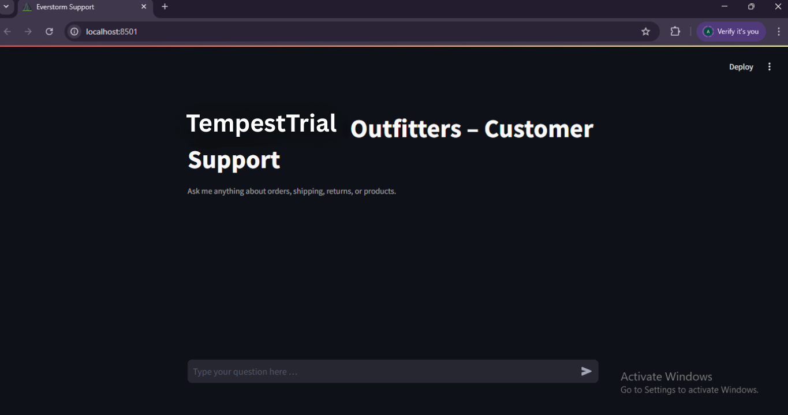
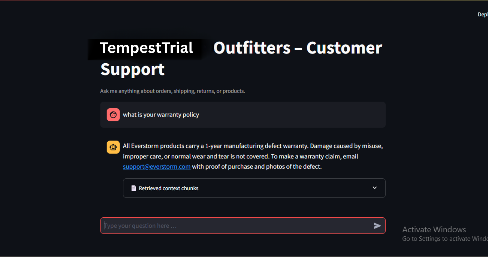

# 🤖 TempestTrail Outfitters – Customer Support Chatbot

---

## 📌 Project Description

This project is a **RAG-based Customer Support Chatbot** built for a fictional e-commerce store, TempestTrail Outfitters.

The system uses:

• Retrieval-Augmented Generation (RAG)  
• FAISS Vector Store  
• Sentence Transformer Embeddings  
• Local LLM via Ollama (Gemma 3 1B)  

to answer customer questions about orders, shipping, returns, and products — fully offline with no API keys required.

---

## 🎯 Objective of the Application

The main objective is to develop a system that:

• Loads and processes PDF policy documents  
• Chunks text into retrievable segments  
• Converts chunks into semantic embeddings  
• Retrieves relevant context based on user query  
• Generates grounded, accurate answers using a local LLM  
• Displays results through a clean Streamlit chat UI  

---

## 🛠 Tools and Technologies Used

| Tool | Purpose |
|---|---|
| Python | Programming Language |
| LangChain | RAG Framework |
| Ollama + Gemma3:1b | Local LLM for Response Generation |
| FAISS | Vector Store for Similarity Search |
| SentenceTransformers (gte-small) | Text Embeddings |
| PyPDFLoader | PDF Text Extraction |
| Streamlit | Chat Web Interface |
| Conda | Environment Management |
| Git & GitHub | Version Control |

---

# 🚀 Project Preview

## ⚙️ Environment Setup
Conda environment created and all packages installed from `environment.yml`.



---

## 📥 Ollama – Gemma3:1b Model Pull
Model downloaded successfully (815 MB) and ready to serve locally.



---

## 🔄 Streamlit App – Loading Knowledge Base
FAISS index loading on app startup.



---

## 💬 Streamlit App – Chat Interface Ready
Chat UI ready and waiting for user input at `http://localhost:8501`.



---

## ✅ Live Answer with Retrieved Context
Chatbot answering a question with a grounded response and expandable source chunks.



---

# 🗂 Project Structure

```
rag-chatbot/
├── environment.yml          # Conda dependencies
├── generate_data.py         # Script to generate synthetic PDF files
├── notebook.ipynb           # Main project notebook
├── app.py                   # Streamlit chat UI
├── faiss_index/             # Saved FAISS vector index (auto-generated)
│   ├── index.faiss
│   └── index.pkl
├── screenshots/             # Project screenshots for README
└── data/                    # Synthetic PDF knowledge base
    ├── TempestTrail_Refund_Policy.pdf
    ├── TempestTrail_Shipping_Policy.pdf
    ├── TempestTrail_Contact_Support.pdf
    ├── TempestTrail_Product_Sizing.pdf
    └── TempestTrail_Loyalty_Promotions.pdf
```

---

## ⚙️ Installation Steps

### Step 1: Clone Repository

```
git clone https://github.com/anusha-sundaramurthi/rag-chatbot.git
```

---

### Step 2: Go to project folder

```
cd rag-chatbot
```

---

### Step 3: Create and activate Conda environment

```
conda env create -f environment.yml
conda activate rag-chatbot
```

---

### Step 4: Generate synthetic PDF data

```
python generate_data.py
```

---

### Step 5: Install and start Ollama

Download from: https://ollama.com/download

```
ollama pull gemma3:1b
```

---

## ▶️ How to Run

### Run the Notebook

Open `notebook.ipynb` in VS Code, select the **rag-chatbot** kernel, and run all cells in order.

---

### Launch the Streamlit UI

```
streamlit run app.py
```

Open browser:

```
http://localhost:8501
```

---

## 🚀 Project Features

✅ Upload and parse PDF policy documents  

✅ Automatic text chunking with overlap  

✅ Semantic embeddings using gte-small  

✅ FAISS vector index for fast retrieval  

✅ Local LLM inference via Ollama  

✅ Grounded answers with no hallucination  

✅ Expandable retrieved context chunks  

✅ Full conversation history support  

✅ Clean Streamlit chat interface  

---

## 🧠 RAG Pipeline Used

This project uses:

• Retrieval-Augmented Generation (RAG)  

• Sentence Transformer Embeddings  

• FAISS Nearest-Neighbour Search  

• ConversationalRetrievalChain (LangChain)  

---

## 🔍 How the System Works

```
User Question
     ↓
FAISS Retriever
(finds top-8 relevant chunks from PDFs)
     ↓
System Prompt
(injects context + rules)
     ↓
Gemma3:1b LLM via Ollama
(generates grounded answer)
     ↓
Final Answer displayed in Streamlit UI
```

---

## 📄 Knowledge Base Documents

| PDF File | Topics Covered |
|---|---|
| `TempestTrail_Refund_Policy.pdf` | 30-day returns, eligibility, how to return, damaged items |
| `TempestTrail_Shipping_Policy.pdf` | Processing times, domestic/international shipping, tracking |
| `TempestTrail_Contact_Support.pdf` | Live chat, email, phone, operating hours, escalation |
| `TempestTrail_Product_Sizing.pdf` | Size charts, materials, care instructions, warranty |
| `TempestTrail_Loyalty_Promotions.pdf` | Storm Rewards tiers, referral bonus, promo codes, sales |

---

## ⚙️ Tunable Parameters

| Parameter | Default | Effect |
|---|---|---|
| `chunk_size` | 300 | Size of each text chunk |
| `chunk_overlap` | 30 | Overlap between chunks |
| `k` | 8 | Number of chunks retrieved per query |
| `temperature` | 0.1 | LLM creativity (lower = more factual) |
| `model` | `gemma3:1b` | Swap for larger model for better answers |

---

## 👩‍💻 Author

Name: Anusha Sundaramurthi  

Course: B.Tech | Computer Science and Engineering

Project: TempestTrail Outfitters – Customer Support Chatbot (RAG System)

---

## 📌 GitHub Repository

```
https://github.com/anusha-sundaramurthi/rag-chatbot
```

---

## ⭐ Conclusion

This project demonstrates a real-world implementation of Retrieval-Augmented Generation using LangChain, FAISS, Sentence Transformers, and a local Gemma LLM via Ollama — enabling accurate, grounded, and fully offline customer support for an e-commerce store.

---